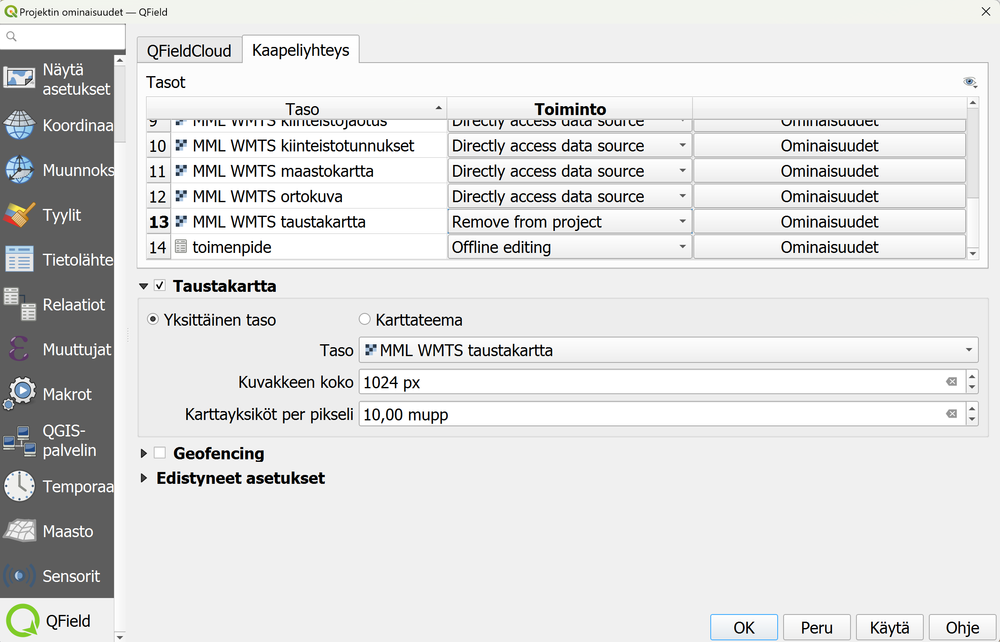

# Ennakkovalmistelut

- Asenna itsellesi tietokoneelle [QGISin viimeisin vakaa versio (LTR)](https://qgis.org/fi/site/forusers/download.html).
- Asenna mobiililaitteellesi [QField-sovellus sovelluskaupastasi](https://qfield.org/).

Lataa GeoPackage-tiedosto: 

- [QGIS-projekti (testiversio 1.0)](https://drive.google.com/file/d/1X60nPkYzK7NCFw8Bfq_cCwHwdfYa0UkG/view?usp=drive_link) 

## Projektin avaaminen

Edellä ladattu GeoPackage-tiedosto sisältää QGIS-projektin, sekä kaikki tarvittavat tasot ja taulukot. Avaa QGIS tietokoneellasi ja raahaa lataamasi GeoPackage-tiedosto QGIS-ohjelmaan. Kun päästät irti tiedostosta niin uusi ikkuna aukeaa. Valitse tästä ainoastaan *projekti_poc* (kuten kuvassa). Silloin QGIS avaa projektin sinulle suoraan, tasot ovat valmiiksi kytketty projektiin, joten tämän takia niitä ei lisätä erikseen.

## Lisäosan asentaminen
Asenna QGISin lisäosan "QField Sync", jos et ole sitä aiemmin tehnyt. Yleiset ohjeet tähän on annettu alla olevassa videossa:

Tässä kuvassa näet miltä projekti, johon on lisätty hieman esimerkinomaista testidataa, näyttää oletusasetuksilla. 

**Tasot**-näkymässä näet, tasoja ryhmiteltynä teemoittain.

Kokeet ja toimenpiteet -ryhmän alla on seuraavat taulukko-muotoiset tasot (tasojen tarkemmat ominaisuudet kuvataan näissä ohjeissa myöhemmin):

| Taso | Muoto | Selite |
|----------|----------|----------|
| Koe| Ei geometriaa| Tehtävistä kokeet. Koe liittyy aina johonkin koesarjaan |
| Koesarja | Ei geometriaa | |
| Toimenpide | Ei geometriaa | Kokeelle tilattavat toimenpiteet koemetsikkötasolla|

Geometrioita sisältävät tasot:

|Taso | Muoto | Selite |
|----------|----------|----------|
| Liittyva Piste| Piste | |
| Liittyva Viiva| Viiva | |
| Liittyva Alue| Polygoni | |
| Koeala | Polygoni | |
| Koemetsikkö | Polygoni | |

- **Kiinteistöt**-tasoryhmän alla on LUKE:n tarjoamasta WMTS-rajapinnasta tulevia aputasoja kiinteistötunnusten ja -jaotuksien tarkastelemiseksi.

- **Taustakartat**-tasoryhmässä on valittavana erityyppisiä taustakarttoja aineiston tarkastelun ja digitoinnin tueksi.

Ryhmässä "Koodistot" on myös taulukkotasoja, mutta nämä ovat stattisia tauluja, mistä haetaan tietoja yllä oleviin tasoihin, joten näihin ei kannata koskea. Sieltä voi kuitenkin katsoa, mitä koodeja on käytössä.

## Taustakartan lisääminen offline-käyttöä varten

Projektin oletustaustakartat tulevat WMTS-rajapinnasta internet-yhteyden kautta. Mikäli häiriötön tai tarpeeksi nopea verkkoyhteys maastossa ei ole taattu, taustakartoista voidaan irroittaa haluttu alue Geopackage-tiedostoon. Tämän tekemiseksi, on mentävä  projektin ominaisuuksiin (Projekti-> Ominaisuudet -> QField). Samaan dialogiin pääsee myös QGISin työkalupalkin QFieldSync-työkalujen kautta: 

  
Valitse **Kaapeliyhteys**-välilehti (Cable export), ja mene siellä osioon **Taustakartta** (Base map), jossa voi valita offline-taustakarttatason teon ruksaamalla **Taustakartta**-valintalaatikko. Alla olevassa kuvassa on käytetty esimerkkinä **MML WMTS taustakartta** -tasoa, mutta tähän voit valita minkä tahansa alasvetovalikossa näkyvän tason (kaikki rajapintayhteydellä lisätyt tasot), jonka tarvitset. Voit esimerkiksi tarvita ilmakuvan, silloin vaihdat siihen ilmakuvatason. Käytännössä taustakarttasi tallentuu näin QFieldSync-pakkauksen jälkeen geopackage-tiedostoon joka kulkee projektin mukana. Offline-taustakartan resoluutio määritetään myös tässä **Karttayksiköt per pikseli**-asetuksella (Map unit per pixel, mupp). Projektissa oletuksena käytetyt kartat ovat EPSG:3067-koordinaattijärjestelmässä, joten yksikköinä on metri. Lisätietoa taustakartan konfiguraatiosta löytyy [dokumentaatiosta](https://docs.qfield.org/get-started/tutorials/get-started-qfs/#base-map-configuration)

Tarkista myös taustakartta-asetusten yläpuolella oleva **Tasot**-osio. Pitääksesi projektin mahdollisimman yksinkertaisena, "kevyenä", voit nyt valita **Toiminto**-tilasta (Action) "**Remove from project**" (Directly access data source -valinnan sijasta) tasolle, jonka äsken konfiguroit Geopackageen lisättäväksi. Silloin tasoa ei haeta tuplasti rajapinnan kautta QFieldissa, vaan ainoastaan Geopackagesta taustakarttana. Toki jos arvelet, että saatat tarvita kyseistä tasoa myös rajapinnasta haettuna (esim. resoluution, alueen tai datan päivittymisen takia), voit jättää Toiminto-asetuksen vaihtamatta ja oletuksena piilottaa rajapinta-tason näkymästä QFieldissa (ohjeet myöhemmin).

Huomaa myös, että edellä pystyi määrittämään ainostaan yhden taustakarttatason offline-käyttöön. Jos tarvitset tarkoitukseen useampia tasoja, niin hyvä käytäntö olisi rajata alue tarkkaan ja ladata etukäteen tarvittavat rasteriaineistot tiedostoina (eli ei rajapinnan kautta), ja lisätä ne tasoina QGIS-projektiin. **Toiminto**-tila pitää näille tasoille olla "**Offline editing**"-tilassa, kuten kaikki muutkin tasot.

QGIS-projekti viedään seuraavaksi QField-projektina mobiililaitteelle. Voidaan ajatella, että QGIS-projektista tehdään kopio, mutta tietyllä tavalla paketoitu, jotta QField-sovellus voi sitä käyttää. QField-sovelluksessa kerätään tietoja ja tämän jälkeen viedään tietoja takaisin tietokoneelle QGISiin, missä voi muokata tietoja ja lopuksi voi viedä ulos tietoja QGISistä esimerkiksi taulukkomuotoon.