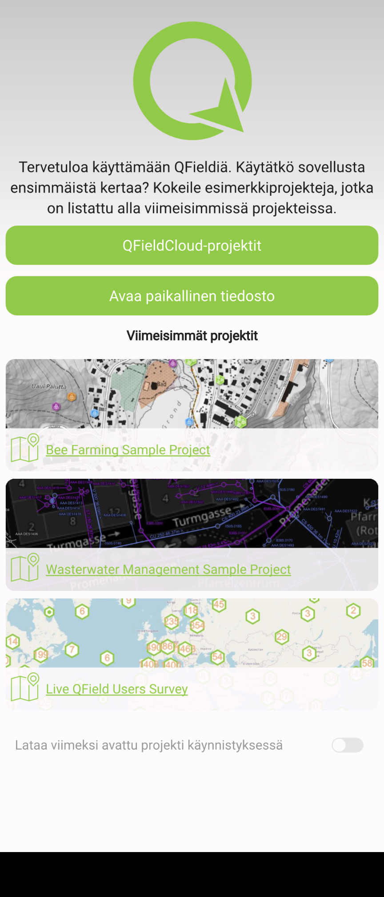
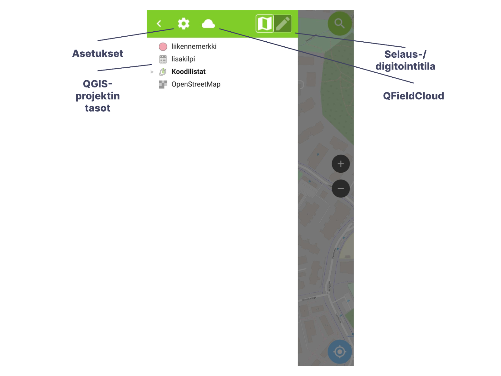
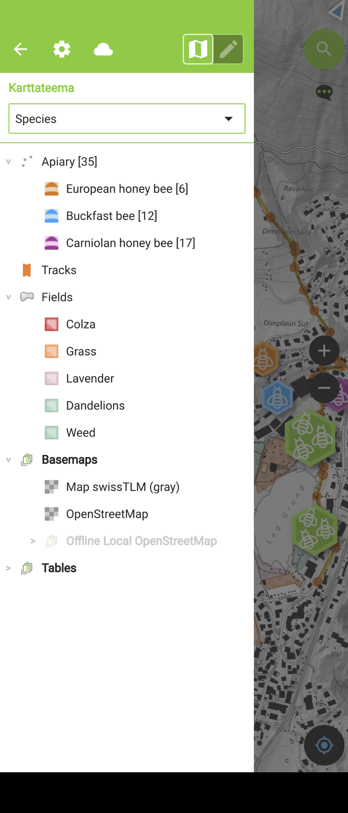
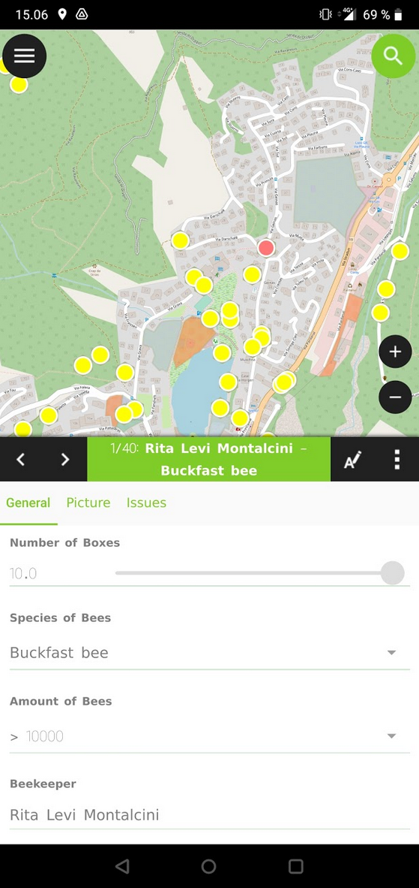

# QFieldin käyttö
Kun avaat QFieldin puhelimella niin oletusnäkymä näyttää tältä:

Valitse "Avaa paikallinen tiedosto" ("Open local file") ja etsi siirtämäsi QGIS-projektitiedosto (eli **.qgs** päätteinen tiedosto).

## Sovelluksen avaaminen ja käyttöliittymä

Avataan nyt QField-sovellus (jos QField kysyy hyväksytäänkö paikallisten tiedostojen käyttö ja paikannus, valitse salli), jolloin sinulle pitäisi ilmestyä alla olevan kuvan mukainen etusivu. Siinä näet oletusvaihtoehtoja projektien avaamiseksi. Nyt **Viimeisimmät projektit** -kohdassa on asennuksen mukana tulevia demoprojekteja, joilla voi tutustua QFieldin käyttöön ilman, että pitää valmistella ensin oma projekti QGISin avulla. Myöhemmin tähän tulee edellisellä kerralla käyttämiäsi projekteja, joita klikkaamalla pääset nopeammin niihin käsiksi.

## QFieldin käyttöliittymä

 Yläreunan oikealta puolelta löytyy **Haku**, jonka avulla voit hakea sekä kohteita projektin vektoritasoista että sijainteja esimerkiksi koordinaattien tai osoitteen perusteella. Toistaiseksi osoitehaku toimii vain osoitteille Suomen alueelta (ominaisuus ollut versiosta 1.9 "Taivaskero" lähtien). Osoitteet perustuvat Digiroadiin.

Käyttöliittymän oikealta sivulta löytyy **Zoomaus-painikkeet**,mutta toki zoomaus toimii myös kahden sormen eleitä käyttämällä kuten mobiililaitteiden karttasovellukset yleensäkin. Näytön alareunasta löytyy **Mittakaava** sekä **Paikannus**. Kun aktivoit paikannuksen, karttapohja seuraa sijaintiasi ja keskittää siihen.

Keskitytään ensimmäiseksi **Valikkoon** -- klikkaa **Valikko** auki vasemmasta yläreunasta. Täältä löydät listauksen QFieldissä avatun QGIS-projektin tasoista. Valikko-näkymän yläreunasta löytyy lisäksi kolme muuta toiminnallisuutta: **Asetukset** sekä **Vaihda selailu-/digitointitila**. Selailutilaa vastaa taitetun kartan näköinen kuvake, kun taas digitointitilaa sen vieressä oleva kynä-ikoni. Käytössä olevaa käyttömoodia eli -tilaa vastaava kuvake on kirkkaana. Demo-projektien avulla pystyy testaamaan myös digitointia, mutta keskitytään nyt aluksi vain aivan peruskäyttöön, joten jätetään selailutila päälle.

Valitse sen sijaan ensiksi **Asetukset (rattaan kuva) \> Asetukset** ja tutustu välilehtien sisältöön. Erityisesti **Yleistä**-välilehdellä voit konfiguroida QFieldin käyttöliittymää sopivaksi. Täältä saat myös valittua QFieldin käyttöliittymän kielen mobiililaitteen käyttöliittymän kielestä riippumattomasti. Mikäli käytössäsi on kännykkä tai muuten pieninäyttöinen mobiililaite, laita **Laajin attribuuttilomake** -asetus päälle klikkaamalla liukukytkimestä. Tällöin digitoidessa tietojen syöttölomake täyttää koko näytön pelkän alalaidan sijaan.

Palaa sitten vielä keskimmäiselle **Paikannus**-välilehdelle. Välilehdellä pystyy määrittämään paikannukseen ja sen näyttämiseen liittyviä asetuksia, esimerkiksi käyttämään ulkoista paikannuslaitetta ja huomioimaan antennin korkeuden vaikutuksen. Käytetään oletuksena kuitenkin nyt mobiililaitteen omaa paikannusta (**Sisäinen laite**). Sen sijaan voit halutessasi aktivoida **Näytä sijainnin tiedot** ja **Aktivoi tarkkuusindikaattori** saadaksesi tietoa koordinaateista ja paikannuksen tarkkuudesta. Sulje **Asetukset** klikkaamalla vasemmasta yläkulmasta, kun olet tarkastellut tarpeeksi.

Valikossa (rattaan kuva) pääsee myös tarkastelemaan QField-sovelluksen perustietoja (Lisätietoja QFieldistä) ja viestilokia (Viestiloki). Takaisin sovelluksen etusivulle pääset valitsemalla Avaa projekti. Valikosta löytyy myös lisätoimintoja mittaustyökalun ja PDF-karttatulosteen muodossa. 

## Selailutila

Tarkastellaan nyt demoprojektiin tallennettuja paikkatietoja. Avaa jälleen valikko, jolloin näet projektiin lisätyt tasot ryhmiteltynä Apiary- ja Fields-ryhmätasoihin (mehiläistarhat ja pellot, piste- ja polygoni-geometriatasoina). Lisäksi on viivamainen Tracks-taso (Jäljet) sekä tasoja ilman geometriaa Tables-ryhmätason alla. Taustakartat on myöskin ryhmitelty  yhteen, ja valittavana on mm. rajapinnasta haettuna OpenStreetMap. Ryhmien edessä näkyy minkätyyppisestä geometriasta on kyse (tässä piste- ja polygonivektoritasot sekä taustakartan rasteritaso). Samaten nähdään tasoille QGISin puolella määritetyt kuvaustyylit sekä tason kohteiden lukumäärä nimen perässä hakasulkeissa. 

Valikossa ylhäällä on myös Karttateema-alasvetovalikko. Karttateemat toimivat Qfieldissa samoin kuin QGISissa, eli teeman määrittelemällä voi hallita karttanäkymää, esimerkiksi mitä tasoja kartalla näytetään kerrallaan tai määrittää samoille tasoille vaihtoehtoisia kuvaustyylejä. Kokeile eri karttateemoja, ja tarkastele miten niiden avulla voidaan vaihdella kartalla näkyviä tietoja.

Pitkä painallus tason tai ryhmän kohdalta avaa näihin liittyviä valintoja ja  toimintoja. Kokeile tätä ensiksi OpenStreetMap-tason kohdalta. Valittavia toimintoja on nyt **Näytä kartalla** -valintalaatikko, jolla tason näkyvyyttä voi hallita, sekä **Zoomaa tasolle** -nappi. Voit kokeilla jälkimmäistä, jolloin karttaikkunaan piirtyy koko maailmankartan laajuiseksi, jolloin voi helpommin huomata tasojen sijainnin suhteessa käyttäjään. Kokeile nyt vastaavasti jotakin vektoritasoa, esimerkiksi **Buckfast bee** -tasoa. Tällöin vaihtoehtona on lisäksi **Näytä kohdelista**, jolla voi tarkastella tason kohteiden listaa ja yksittäisten kohteiden attribuutteja. Listanäkymästä pääsee pois klikkaamalla vasemman ylänurkan nuolta. 

Kohteita pystyy tarkastelemaan myös suoraan karttanäkymästä kohteita klikkaamalla. Tehdäänkin nyt näin, eli siirry karttanäkymään ja klikkaa jotakin pistemäistä kohdetta. Tällöinkin aukeaa ensin listausikkuna, jossa tyypillisesti on ainoastaan pelkästään klikattu kohde (tai lähekkäisiä/päällekkäisiä kohteita). Klikkaamalla listassa olevaa kohdetta avautuu kohteen tietolomake (kuvassa alla). Huomaa lomakkeen muutama eri välilehti (**General, Picture, Issues, jne.**), joiden välillä pääsee liikkumaan joko sivulle liu'uttamalla tai  otsikosta klikkaamalla.

Tarkastele nyt lomakkeen tietoja. Huomaat, että tiedot on harmaalla ja vaikka tietojen syöttötapa (esimerkiksi tekstilaatikko tai vetovalikko) on näkyvissä niitä ei pysty muokkaamaan. Valmiiden kohteiden muokkaaminen onnistuu kuitenkin myös QFieldin selaus-moodissa. Klikkaa lomakkeen tietojen editointi aktiiviseksi lomakkeen yläpalkin kuvakkeesta jossa on kynä sekä A-kirjain, kohteen nimen oikealta puolelta. Tämän jälkeen arvojen muuttaminen onnistuu. Muokatut arvot voi joko tallentaa tai hylätä nyt yläpalkin kulmista, joko oikein-merkkiä tai ruksia painamalla. Kokeile muuttaa jonkin kohteen kaikkia ominaisuuksia, mukaan lukien valokuvaa. Sulje tämän jälkeen ominaisuustietolomake, joko liu'uttamalla lomake ylälaidasta alas, tai näytön alalaidasta "takaisin"-nuolta painamalla. Tämän jälkeen voit sulkea projektin sekä sovelluksen. Se puolestaan onnistuu klikkaamalla alalaidan "takaisin"-nuolta kahdesti.

Huomaa myös kohteen attribuuttilomakkeen yläpalkin oikeasta reunasta löytyvä lisävalintoja-painike. Painikkeesta aukeavasta valikosta löydät mm. kehys-kuvakkeen, joka kohdistaa karttanäkymän kohteeseen. Attribuuttilomakkeen yläpalkin vasemmanpuoleisilla nuolipainikkeilla pystyy puolestaan siirtymään kohdelistauksessa mahdollisesti oleviin edellisiin ja seuraaviin kohteisiin. 

## Käyttäjänimen lisäys

Sovelluksen yläreunan vasemmalta puolelta löytyy **Valikko**, jota klikkaamalla saat näkyviin mm. QGIS-projektin tasot ja muut asetukset.

Siirrytään tämän jälkeen oikeanpuolimmaiseen **Muuttujat**-välilehteen, joka keskittyy sekä tiettyihin QGISin versio- ym. muuttujiin että mobiililaitteen käyttöliittymän muuttujiin. Täällä voi myös määritellä omia muuttujia. Klikkaa alareunan **Lisää uusi muuttuja**, ja anna muuttujalle nimeksi **username** sekä arvoksi oma nimesi. Käytämme tätä myöhemmin harjoituksissa tallentamaan muokkaajatiedot tason kohteille.

## Tiedon keruu ja tietojen muokkaus

Tasoilla on joukko attribuutteja, joiden tiedot QField täyttää oletuksena. UUID, muokkaaja, luoja, 

### Koemetsikkö-taso

### Koeala-taso

### Liittyvät kohteet

### Kokeet ja toimenpiteet

### Tietojen haku tasoilta

### Massatoiminnot

### Karttateemat

